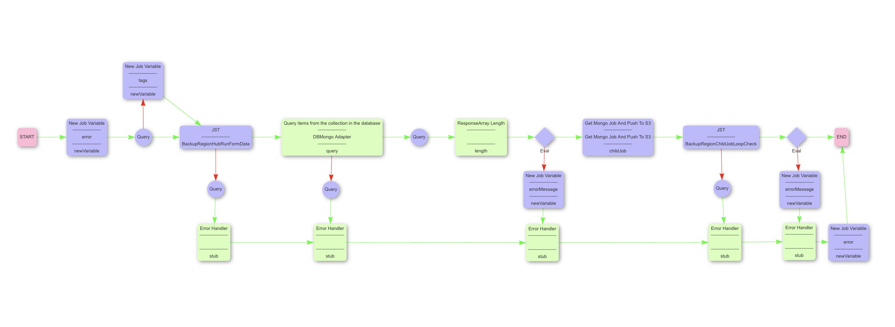
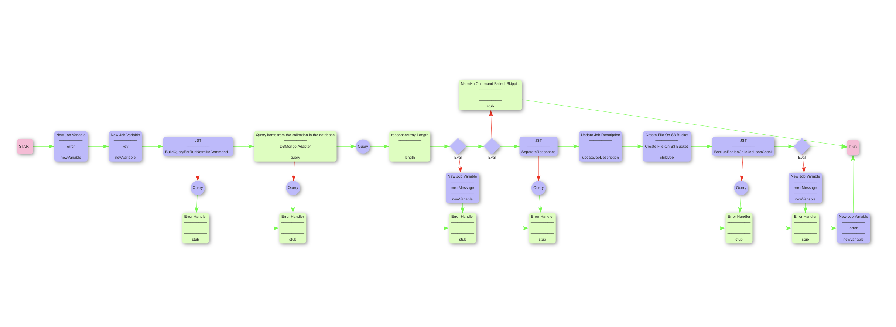
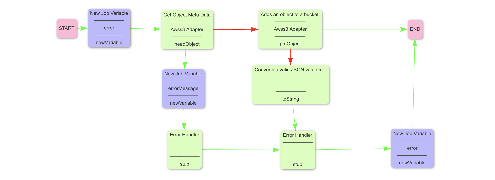
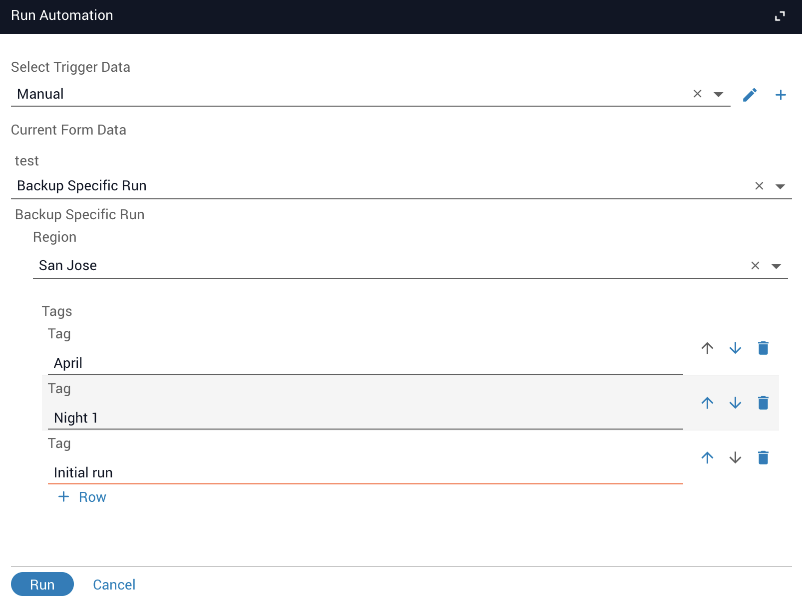

<!-- This is a comment in md (Markdown) format, it will not be visible to the end user -->

<!-- Update the below line with your Pre-Built name -->
# Backup Region Hub Run

<!-- Leave TOC intact unless you've added or removed headers -->
## Table of Contents

* [Overview](#overview)
* [Installation Prerequisites](#installation-prerequisites)
* [Requirements](#requirements)
* [Features](#features)
* [Future Enhancements](#future-enhancements)
* [How to Install](#how-to-install)
* [How to Run](#how-to-run)
* [Additional Information](#additional-information)

## Overview
The "Backup Region Hub Prebuilt" is used to retrevive the commands and results from a previous job run of the "Run Regional Hub" prebuilt and store them in an AWS S3 bucket. 

<table><tr><td>
  
</td></tr></table>
The "Backup Region Hub Run" workflow takes the form input and creates the Mongo query using the "BackupRegionHubRunFormData" JST. It then Queries the Mongo DB and checks if it got a successful response back with job ids. It then sequentialy loops though those job ids and calls the workflow "Get Mongo Job And Push To S3".

<table><tr><td>
  
</td></tr></table>
The "Get Mongo Job And Push To S3" then takes that job id and, using the "BuildQueryForRunNetmikoCommands" JST, builds another Mongo DB query to get the netmiko response from that job. The workflow executes that query and validate the response. If the response is valid, it uses the "SeparateResponses" JST to separete the individual commands/responses of the results since a single netmiko taks can run multiple commands on the same device. It creats a json file with all the job information including the command, response, device, and any tags. For each command/response the workflow calls another child job "Create File On S3 Bucket" to send the file to an S3 bucket.

<table><tr><td>
  
</td></tr></table>
The "Create File On S3 Bucket" then takes that information and verifys that file does not already exist on the specifed S3 bucket. If it does not, It creates the file and returns to the parent job.

<!-- ADD ESTIMATED RUN TIME HERE -->
<!-- e.g. Estimated Run Time: 34 min. -->
_Estimated Run Time_: 1-30 mins depending on the size of the Run Regional Hub jobr

## Installation Prerequisites

Users must satisfy the following pre-requisites:

<!-- Include any other required apps or adapters in this list -->
<!-- Ex.: EC2 Adapter -->
* Itential Automation Platform
  * `^2021.1`
* [AWS S3 adapter](https://gitlab.com/itentialopensource/adapters/cloud/adapter-aws_s3)
* [DB Mongo adapter](https://gitlab.com/itentialopensource/adapters/persistence/adapter-db_mongo)

## Requirements

This Pre-Built requires the following:

 * A previous sucessfull job run of the Run Regional Hub including the unique tags.

## Features

The main benefits and features of the Pre-Built are outlined below.

<!-- Unordered list highlighting the most exciting features of the Pre-Built -->
<!-- EXAMPLE -->
 * Error handling to ensure a successful job run
<!-- * Displays dry-run to user (asking for confirmation) prior to pushing config to the device -->
<!-- * Verifies downloaded file integrity (using md5), will try to download again if failed -->

## Future Enhancements

* TBD

## How to Install

To install the Pre-Built:

* Verify you are running a supported version of the Itential Automation Platform (IAP) as listed above in the [Requirements](#requirements) section in order to install the Pre-Built. 
* The Pre-Built can be installed from within App-Admin_Essential. Simply search for the name of your desired Pre-Built and click the install button (as shown below).

## How to Run

Use the following to run the Pre-Built:
* Navigate to the Operations Manger Automation named "Backup Region Hub Run"
* Run the manual trigger and fill out the form.
  * To backup the entire region, select "Backup Entire Region" from the dropdown list
    <table><tr><td>
    
    </td></tr></table>
  *  To backup a specific run, select "Backup Specific Run" from the dropdown list. Then add the exact tags from the previous "Run Regional Hub" job.
    <table><tr><td>
    
    </td></tr></table>
* select run.

## Additional Information

Please use your Itential Customer Success account if you need support when using this Pre-Built.